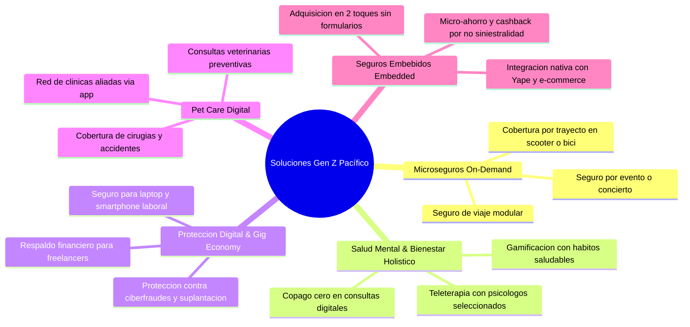

# Hackathon Pacífico: Generación Z

---

## 1. Dinámica Inicial y Control de Equipo

- **Estado:** En progreso
- **Ofrezco:** 
- **Busco:** 

---

## 2. Visión General del Desafío

- **Reto principal:** ¿Cómo diseñar una solución de seguros y protección altamente relevante, accesible y atractiva para la Generación Z en el Perú?
- **Punto de partida:** Identificación, empatía y entendimiento profundo de la problemática real del usuario joven antes de proponer tecnología o producto.
- **Propósito de Pacífico:** Proteger la felicidad y tranquilidad de las personas (no simplemente vender pólizas tradicionales). Meta país: Contribuir a que Perú sea una sociedad más protegida, informada y resiliente.
- **Premio:** 2 equipos ganadores con pase a incubación / reconocimiento corporativo.

---

## 3. Fechas Clave y Entregables

| Fecha | Hito | Detalles y Recomendaciones |
| :--- | :--- | :--- |
| **01 Set.** | **Kick-Off** | Lanzamiento oficial del reto, contextualización y lineamientos estratégicos. |
| **04 Set.** | **Mentorías en Pacífico Seguros** | Sesión estratégica presencial/virtual con expertos de la industria. *(Tip: Agendar en los primeros turnos para recibir feedback temprano).* |
| **08 Set.** | **Deadline de Entrega** | Envío final de entregables obligatorios (**One-Pager** y **Video Pitch**). |
| **10 Set.** | **Anuncio de Finalistas** | Notificación oficial de los 10 equipos clasificados al Demo Day. |
| **11 Set.** | **Demo Day / Gran Final** | Presentación del pitch en vivo ante el jurado calificador (1 o máximo 2 expositores). |

---

### Pautas Críticas para los Entregables (08 Set.)

#### A. One-Pager (Resumen Ejecutivo)
- **Formato:** 1 sola página / diapositiva de alto impacto visual (*single glance*).
- **Contenido obligatorio:**
  - **Definición clara del problema:** El dolor real y cuantificado del usuario.
  - **Público objetivo:** Segmentación y arquetipo específico dentro de la Gen Z.
  - **Solución y propuesta de valor:** Qué hace la solución, por qué es única y cómo resuelve el dolor.
  - **Capturas del prototipo (*mockups*):** Interfaces clave de la experiencia de usuario (UX/UI).
  - **Diferenciación y modelo de negocio:** Viabilidad comercial, canales de adquisición y valor para Pacífico.
- **Tip clave:** Debe ser visualmente limpio, directo, profesional y autoexplicativo en menos de 60 segundos de lectura.

#### B. Video Pitch
- **Enfoque:** No limitarse a hacer un recorrido funcional de la app/prototipo.
- **Estructura narrativa recomendada:**
  1. **Contexto e investigación:** Explicar el trasfondo y la necesidad insatisfecha identificada con evidencia de campo.
  2. **Justificación del proceso:** Por qué se llegó a esta solución y cómo los *insights* moldearon la propuesta.
  3. **Demostración (*demo flow*):** Mostrar cómo el prototipo resuelve el problema con cero fricciones.
  4. **Cierre y visión:** Impacto esperado y sostenibilidad del modelo.

---

## 4. Criterios de Evaluación

### A. Selección de Finalistas (Top 10 - Filtro de Entregables)
1. **Claridad y profundidad del problema:** Comprensión rigurosa del dolor del usuario; no asumir problemas superficiales.
2. **Evidencia de campo y validación:** Respaldo con datos cualitativos/cuantitativos, encuestas y entrevistas reales.
3. **Innovación y diferenciación:** Originalidad de la propuesta frente a alternativas existentes en el mercado.
4. **Potencial de negocio y escalabilidad:** Capacidad de atracción de nuevos usuarios, rentabilidad y sinergia con el ecosistema de Pacífico / Credicorp.

### B. Demo Day (Evaluación del Jurado en Vivo)
1. **Claridad del problema y narrativa:** Storytelling convincente y fundamentado.
2. **Innovación disruptiva:** Pensamiento *"fuera de la caja"* respaldado con lógica técnica y comercial sólida.
3. **Potencial y sostenibilidad:** Modelo de negocio viable (CAC, LTV, monetización, retención).
4. **Factibilidad técnica y operativa:** Implementabilidad real, uso de APIs, simplicidad arquitectónica y alineación regulatoria.

---

## 5. Guía Estratégica para las Mentorías (04 Set.)

> [!IMPORTANT]
> Las mentorías **no son para idear desde cero**, sino para **validar hipótesis, recibir feedback crítico y retar supuestos** con líderes de Pacífico.

- **Llegar con avances tangibles:** Llevar el problema definido, los hallazgos de campo y un primer bosquejo/flujo del prototipo.
- **Prioridad de agenda:** Intentar ser los primeros en reservar horario con los mentores clave (negocio, UX, producto, actuarial/técnico).
- **Preguntas concretas:** Evitar preguntas genéricas; formular dudas específicas sobre viabilidad, integración con canales (ej. Yape, bancaseguros) y apetito de riesgo de Pacífico.
- **Validar el modelo Go-To-Market (GTM):** Preguntar qué canales y dinámicas de distribución han funcionado o fallado antes en la compañía.

---

## 6. Estructura y Consejos para el Pitch (3 Minutos)

### Dinámica de Exposición
- **Expositores:** Máximo 1 o 2 personas en tarima/cámara para mantener fluidez y dinamismo.
- **Tiempo límite:** 3 minutos estrictos (ensayar con cronómetro a 2:45 min para margen de seguridad).

### Estructura Minuto a Minuto
1. **Minuto 0:00 - 0:45 | El Gran Problema y Gancho (Hook):** Historia real o dato impactante que evidencie la brecha de protección en la Gen Z.
2. **Minuto 0:45 - 1:15 | Segmento & Insight Revelador:** Quién es el arquetipo, qué dolor oculto tiene y por qué los seguros actuales fallan con ellos.
3. **Minuto 1:15 - 2:15 | Solución y Demostración del Prototipo:** Mostrar la propuesta de valor en acción resolviendo el dolor con simplicidad radical.
4. **Minuto 2:15 - 3:00 | Modelo de Negocio, Go-To-Market e Impacto:** Cómo gana dinero Pacífico, cómo se adquieren usuarios masivamente y métricas proyectadas.

### Regla de Oro: Efecto Primacía y Recencia
- **Primeros 30 segundos (Primacía):** Captar la atención total del jurado con un gancho emocional o estadístico inolvidable.
- **Últimos 30 segundos (Recencia):** Dejar una frase de cierre potente que sintetice la visión y por qué este equipo debe ganar.

---

## 7. Buenas Prácticas (Do's & Don'ts)

### Lo que SÍ hacer:
- **Enfocarse en el *por qué*:** Transmitir la raíz del problema antes de vender características técnicas.
- **Sustentar con datos:** Respaldar afirmaciones con estadísticas del mercado peruano e investigación primaria.
- **Simplicidad radical:** Los mejores productos se explican en una sola frase; eliminar complejidades innecesarias.
- **Alineación con la rúbrica:** Diseñar el pitch para responder explícitamente a cada criterio del jurado.
- **Ensayar transiciones:** Si exponen dos personas, coordinar cambios de voz precisos y sin pausas incómodas.

### Lo que NO hacer:
- Basar el proyecto en suposiciones personales no validadas con usuarios reales de la Gen Z.
- Usar jergas técnicas excesivas, tecnicismos de seguros incomprensibles o lenguaje informal inapropiado.
- Sobrecargar diapositivas con párrafos densos o fuentes ilegibles.
- Pasarse de los 3 minutos (corte inmediato del jurado).
- Presentar un prototipo que parezca una simple web estática sin flujo interactivo.

---

## 8. Entendimiento del Contexto: ¿Por qué Pacífico Seguros apuesta por la Gen Z?

### El Reto de la Industria Aseguradora
- Tradicionalmente, los seguros se perciben como un producto complejo, burocrático, poco transparente y costoso.
- **El verdadero propósito de Pacífico:** No se trata de "vender pólizas", sino de **proteger la felicidad, estabilidad y continuidad de vida de las personas**.
- **El peso demográfico:** La Generación Z y los jóvenes adultos representan más del 25% de la Población Económicamente Activa (PEA) en el Perú, y hacia 2030 superarán los 7 millones de personas en edad productiva.

### El Cambio de Paradigma: Ruptura de la Vida Lineal
- **El modelo tradicional (Generaciones anteriores):** Ruta lineal predecible $\rightarrow$ Universidad $\rightarrow$ Trabajo formal estable $\rightarrow$ Matrimonio $\rightarrow$ Comprar casa/auto $\rightarrow$ Hijos $\rightarrow$ Jubilación.
- **El modelo Generación Z:**
  - Metas líquidas y dinámicas: Flexibilidad, viajes, nomadismo digital, proyectos freelance, emprendimientos, economía de creadores.
  - Nuevas prioridades: Salud mental, bienestar emocional, protección de mascotas (hijos de cuatro patas), protección de herramientas tecnológicas y experiencias de vida.
  - Tolerancia cero a la burocracia: Todo debe resolverse en pocos toques desde el smartphone (al estilo Yape, Nubank, Revolut o Spotify).

### Casos de Éxito e Inspiración Fintech / Insurtech
- **Revolut:** Reinventó la experiencia bancaria y de seguros para viajeros con activación on-demand en un clic.
- **Nubank:** Eliminó las sucursales físicas, el papeleo y el lenguaje críptico con transparencia total y atención humana 24/7.
- **Yape:** Pasó de ser una app de transferencias a la plataforma de pagos y microservicios más utilizada del Perú, convertida en verbo cotidiano.
- **Lemonade (Insurtech global):** Pólizas transparentes basadas en IA en 90 segundos, procesamiento de siniestros instantáneo y devolución de excedentes (*Giveback* social).

---

## 9. Metodología de Trabajo: Doble Diamante (Double Diamond)

```
       DESCUBRIR           DEFINIR             IDEAR            ENTREGAR
     (Divergencia)      (Convergencia)     (Divergencia)     (Convergencia)
     
        /\                  \/                /\                  \/
       /  \                /  \              /  \                /  \
      /    \              /    \            /    \              /    \
     /      \            /      \          /      \            /      \
    / Investigar \      / Sintetizar \    / Lluvia de \      / Prototipar \
    \  Empatía   /      \  Insights  /    \  Soluciones/      \  y Validar/
     \          /        \          /      \          /        \          /
      \        /          \        /        \        /          \        /
       \      /            \      /          \      /            \      /
        \    /              \    /            \    /              \    /
         \  /                \  /              \  /                \  /
          \/                  \/                \/                  \/
     [Problema Difuso]   [Problema Claro]  [Múltiples Ideas]   [Solución MVP]
```

### Diamante 1: Entendimiento y Definición del Problema
1. **Descubrir (Empatizar):**
   - Aplicar encuestas y entrevistas en profundidad con preguntas abiertas (evitar preguntas sesgadas de "sí/no").
   - Indagar en las emociones subyacentes: miedos ocultos, sensaciones de vulnerabilidad económica, frustraciones al enfermarse o sufrir pérdidas.
2. **Definir (Sintetizar Insights):**
   - Agrupar patrones de dolor comunes.
   - Redactar el *Problem Statement* definitivo: *"Los jóvenes de la Gen Z necesitan [necesidad] porque [insight profundo], pero hoy no lo logran debido a [fricción actual]"*.

### Diamante 2: Ideación y Construcción de la Solución
1. **Idear (Exploración de alternativas):**
   - Benchmarking internacional y local de soluciones Insurtech y Fintech.
   - Lluvia de ideas sin restricciones iniciales de presupuesto o arquitectura tradicional.
2. **Entregar / Prototipar (Convergencia en MVP):**
   - Priorizar funcionalidades basadas estrictamente en resolver el problema núcleo (evitar *feature creep*).
   - Diseñar wireframes/mockups interactivos en Figma centrados en facilidad de uso.
   - Definir la estrategia Go-To-Market (GTM): canales de adquisición digital, alianzas y embudo de conversión.

---

## 10. Matriz de Insights y Oportunidades Clave para la Gen Z (Aporte de Valor)

### A. Insights Psicológicos y de Comportamiento
1. **"Siento que un seguro tradicional es dinero perdido":** La Gen Z no quiere pagar cuotas mensuales por algo que "quizás nunca use". Prefieren modelos con **recompensas por hábitos saludables, cashback, micro-ahorros vinculados o esquemas de pago por uso (*Pay-as-you-go*)**.
2. **"No entiendo la letra chica ni confío en los trámites":** Desconfianza histórica hacia cláusulas de exclusión complejas. Exigen **transparencia radical en 3 viñetas, sin jerga legal y con reclamos aprobados en minutos vía app**.
3. **"Mi estilo de vida es flexible, mi protección también debe serlo":** Rechazo a contratos anuales forzosos. Necesitan **microseguros modulares por suscripción mensual cancelable en un clic**, o coberturas temporales (por viaje, por fin de semana, por evento).
4. **"Mis prioridades son distintas a las de mis padres":** No buscan asegurar grandes inmuebles ni autos de lujo; buscan proteger su **salud mental, sus mascotas, sus herramientas de trabajo digital (laptops, cámaras, smartphones) y sus viajes**.

---

### B. Arquetipos de Usuario (Gen Z Perú)

| Arquetipo | Descripción | Principales Dolores / Miedos | Oportunidad de Protección |
| :--- | :--- | :--- | :--- |
| **1. El Freelancer / Creador Digital** | Diseñador, programador, creador de contenido o consultor independiente sin beneficios laborales de planilla. | Pérdida de ingresos por enfermedad; robo o daño de laptop/cámara con la que trabaja; ciberataques. | Seguro de herramientas de trabajo + subsidio temporal por incapacidad + ciberseguridad personal. |
| **2. El Pet Parent Comprometido** | Joven que vive solo o en pareja y considera a su perro/gato como parte de su familia inmediata. | Facturas veterinarias impagables ante accidentes o enfermedades graves imprevistas. | Seguro veterinario 100% digital con teleconsulta 24/7 y cobertura de emergencias clínicas. |
| **3. El Estudiante / Primer Empleo con Ansiedad Financiera** | Practicante o egresado reciente con presupuesto ajustado y alta carga de estrés/ansiedad. | Burnout, crisis de salud mental, falta de acceso a terapia accesible sin deducibles caros. | Microseguro de bienestar y salud mental con sesiones de psicología digital y apps de mindfulness. |
| **4. El Viajero / Nómada Urbano** | Joven activo que se moviliza en scooter/bici o viaja frecuentemente por turismo y eventos. | Accidentes en trayectos urbanos, pérdida de equipaje, cancelación de eventos/vuelos. | Cobertura on-demand por trayecto urbano o micro-cobertura por viaje/evento en 1 clic. |

---

### C. Territorios de Solución Innovadores para Explorar



1. **Microseguros Embebidos (Embedded Insurance vía Yape / Apps):**
   - Contratación inmediata desde el ecosistema donde ya interactúan (ej. agregar cobertura de cancelación o robo al comprar una entrada en Joinnus o pagar con Yape).
2. **Ecosistema Preventivo con Gamificación:**
   - En lugar de ser un producto pasivo, la app premia al usuario con puntos, descuentos en comercios aliados o reembolsos en su prima por mantener hábitos saludables o chequeos preventivos.
3. **Plataforma de Protección Modular ("Arma tu Escudo"):**
   - Una interfaz estilo suscripción donde el usuario selecciona solo lo que le importa proteger este mes (ej. Laptop + Terapia + Mascota) con tarifa transparente y botón de pausa.

---

## 11. Plot Twists y Edge Cases ("¿Qué pasaría si...?")

Un proyecto sobresaliente contempla casos límite y escenarios de estrés para demostrar robustez:

- **¿Qué pasa si el usuario pierde conectividad a internet en plena emergencia?**
  - *Solución:* Credencial digital en Apple Wallet / Google Wallet con código QR y línea de asistencia offline directa.
- **¿Qué pasa si un usuario intenta cometer fraude con reclamos duplicados?**
  - *Solución:* Validación biométrica, geolocalización del incidente y análisis de metadatos de imágenes con IA para verificar autenticidad.
- **¿Qué pasa si el usuario se queda sin dinero en su cuenta de débito?**
  - *Solución:* Periodo de gracia inteligente con micro-pausa de cobertura sin penalidades de cancelación forzada.
- **¿Qué pasa si el usuario no tiene historial crediticio ni experiencia financiera previa?**
  - *Solución:* Onboarding simplificado sin evaluación crediticia invasiva, apalancado en micro-débitos diarios o semanales.

---

## 12. Checklist de Victoria: Próximos Pasos Inmediatos

- [ ] **Definir el Arquetipo Específico:** Elegir 1 solo dolor contundente para no dispersar la solución.
- [ ] **Lanzar Encuesta de Campo Rápida:** Recolectar mínimo 30-50 respuestas y 3 entrevistas a profundidad antes del 03 Set.
- [ ] **Preparar el Tablero de Mentoría:** Tener listo el *Problem Statement*, mapa de empatía y wireframe inicial para la sesión del 04 Set.
- [ ] **Prototipar en Figma:** Crear el flujo principal de usuario enfocado en simplicidad (máximo 3 pantallas clave).
- [ ] **Diseñar el One-Pager:** Asegurar equilibrio visual entre problema, métricas, solución y mockups.
- [ ] **Grabar y Editar el Video Pitch:** Validar que el audio sea impecable y el mensaje no supere los 3 minutos.
