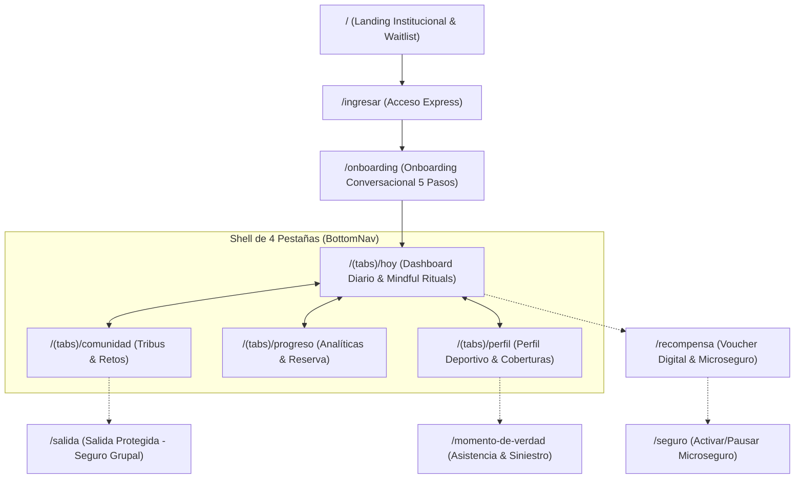

# Esquema de pantallas del prototipo MVP FIBO

> Camino principal: Historia de Camila (`02-ideacion/historias-usuario-y-validacion.md` §2). Cada pantalla está marcada como **Real** o **Simulada** siguiendo exactamente la tabla de `03-mvp/alcance-producto.md` §5 — si hay una discrepancia entre este documento y esa tabla, esa tabla manda (es la fuente original de la decisión). Para el mapa completo de punta a punta (incluyendo lo que pasa antes de instalar la app y al cancelar), ver `customer-journey.md`.
>
> **Corrección de arquitectura (04 Set., mentoría):** FIBO es una app independiente, no una mini-app dentro de Yape — Yape aparece únicamente como método de pago en la pantalla 5. Ver `02-ideacion/hallazgos-mentoria-04-set.md` §3.1.

## Arquitectura Global de Rutas y Pantallas (v3)

El prototipo se organiza en un **Shell con Bottom Navigation de 4 pestañas fijas** y un conjunto de **rutas transaccionales y flujos contextuales dedicados** bajo `app/app/(app)/`:

---

## 1. Flujos de Entrada y Adquisición

### 1.1. Landing Page (`/`) — **Real**
- Hero con visualizador de la Espiral de Fibonacci, mecanismo de retorno de hábitos y formulario de lista de espera conectado a NeonDB.
- Acceso directo al prototipo de la app vía botón *"Probar Prototipo"*.

### 1.2. Acceso Express (`/ingresar`) — **Real**
- Ingreso rápido simulado con número de teléfono o DNI.
- Detección de sesión activa o derivación directa al onboarding para nuevos usuarios.

### 1.3. Onboarding Conversacional (`/onboarding`) — **Real**
- Agente conversacional FIBO (llamada a AWS Bedrock Nova Micro con fallback local inmediato).
- 5 pasos de perfilamiento: situación laboral, foco prioritario (salud mental, finanzas o física), selección de hábitos base.
- **Declaración de Transparencia de Datos:** FIBO explicita que a medida que mantenga sus hábitos se le ofrecerán microseguros sin letra chica ni llamadas invasivas.

---

## 2. Shell Principal: Las 4 Pestañas (`app/app/(app)/(tabs)`)

### 2.1. Tab 1: Dashboard Diario (`/hoy`) — **Real e Interactivo**
- **Calendar Strip Semanal:** Selector reactivo de lunes a domingo con dual-path (días completados vs. días protegidos por el Escudo de Racha).
- **Anillo Diario de Progreso:** Muestra el 0-100% de los hábitos del día en curso con banner de protección activa.
- **Mindful Rituals (Anti-Checkbox):**
  * *Bolsillo:* Modal de Alcancía de Salud (depósito rápido de S/ 5 o S/ 10).
  * *Cuerpo:* Modal de Actividad Física con Live Timer (15/30/45 min) sincronizado en vivo en la tarjeta.
  * *Mente:* Modal de Respiración Guiada 4-4-4 de 30 segundos con check-in emocional.
- **Sincronización de Retos de Comunidad:** Tareas aceptadas en `/comunidad` aparecen como hábito complementario (+10 pts Reserva).
- **Campana de Notificaciones:** Slide-over interactivo (`notificaciones-sheet.tsx`) con recordatorios y avisos de Dr. Online.

### 2.2. Tab 2: Comunidad y Tribus (`/comunidad`) — **Real**
- **Ecosistema de Tribus:** Creación y suscripción por universidad (UCSUR, UPC, etc.), instituto o trabajo; metas colectivas semanales con % de cumplimiento grupal.
- **Retos Colectivos e Individuales:** Desafíos semanales con recompensa en puntos para la Reserva.
- **Botón Transaccional de Salida Protegida:** Card destacada para convocar salidas con seguro de accidentes personales de Pacífico.

### 2.3. Tab 3: Progreso y Analíticas (`/progreso`) — **Real**
- **Sincronización Viva:** Métricas de retos activos y tribu en progreso.
- **Desglose Dinámico por Pilar:** Porcentaje y puntos acumulados en Bolsillo, Cuerpo y Mente.
- **Curva de Crecimiento Compuesto:** Gráfico `AreaChart` (Recharts) interactivo con filtro temporal (`Semana` | `Mes` | `Histórico`).
- **Tarjeta de Derecho Ganado / Microseguro:** Oferta oficial de Microseguro Pay-as-you-go Pacífico a S/ 9.90/mes vía Yape (cobertura médica hasta S/ 15,000).

### 2.4. Tab 4: Perfil de Bienestar y Coberturas (`/perfil`) — **Real**
- **Estética Sobria Deportiva (Strava / Adidas Running):** Avatar sobrio, micro-badge verificado Pacífico.
- **Tira de 4 Métricas Clave:** Racha, Puntos de Reserva, Horas de movimiento, Respaldo médico garantizado.
- **Carrusel Horizontal de Insignias:** Logros visuales desbloqueados.
- **Carrusel Horizontal de Beneficios Pacífico:** Dr. Online telemedicina 24/7, Quererte Sano y Microseguro Pay-as-you-go.
- **Menú de Cuenta iOS:** Póliza, declaración jurada de salud y asesor de reclamos.

---

## 3. Rutas Transaccionales y Flujos Dedicados

### 3.1. Recompensa y Conversión a Seguro (`/recompensa`) — **Real**
- Voucher digital perforado interactivo con código copiable (`FIBO-CALM-2026`).
- Conversión a Microseguro Pay-as-you-go a S/ 9.90/mes vía Yape (hasta S/ 15,000 de respaldo médico).
- Progresión de 3 niveles escalonados (Bajo: Insignia/Guía, Medio: App Mindfulness, Alto: Telemedicina/Especialista).

### 3.2. Salida Protegida (`/salida`) — **Real el flujo y emisión de póliza**
- Ruta transaccional ergonómica de seguro grupal para la Tribu (pichanga, running, trekking, viajes).
- Regla de proporcionalidad del Capitán: solo cubre a los asistentes reales (ej. 12 de 100 miembros).
- Desglose financiero transparente con recaudación Yape (S/ 3.50 por persona/evento).
- Deep linking (`/salida?t=...&act=...&p=...`) con link copiable para compartir en el chat de WhatsApp de la tribu.
- Emisión express con póliza colectiva real (`PAC-TRIBU-XXXX`).

### 3.3. Gestión del Seguro (`/seguro`) — **Real el flujo de control**
- Switch toggle para activar/pausar la cobertura sin penalidad ni trámites burocráticos.

### 3.4. Momento de Verdad (`/momento-de-verdad`) — **Real el flujo conversacional**
- Reporte asistido de siniestro/urgencia guiado por el agente FIBO.
- Subida de foto/evidencia, triaje y escalamiento transparente hacia asesor humano de Pacífico / Dr. Online.

---

## Notas de Implementación Técnica

- Persistencia unificada en cliente vía `ReservaProvider` (`context.tsx`) sincronizada en `localStorage`.
- No requiere backend relacional ni autenticación compleja para la evaluación del hackathon; corre 100% en cliente con llamadas serverless para el agente LLM.
- Especificaciones de diseño detalladas en [`docs/10-features/`](../10-features/).
