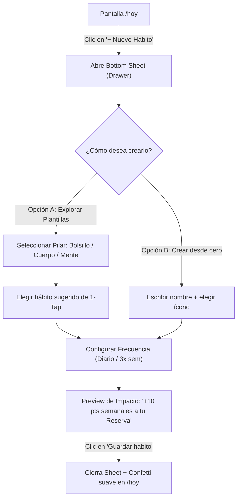

# Feature 02: Flujo de Creación y Personalización de Hábitos (Bottom Sheet)

> **Estado:** Especificación aprobada para implementación  
> **Componente UI:** Drawer / Bottom Sheet (`components/ui/drawer.tsx` o `dialog.tsx`)  
> **Inspiración UX:** Finch (1-tap setup), Fabulous (hábitos basados en ciencia del comportamiento), Notion/Things 3 (simplicidad de captura).

---

## 1. Justificación y Propuesta de Valor

En una app de bienestar para la Generación Z, la rigidez mata la retención. Si bien FIBO viene con 3 hábitos predeterminados (Ahorro chico, Actividad física, Bienestar mental), el usuario debe sentir **autonomía de personalización** para vincular su propia rutina a la Reserva de Pacífico.

### Principio clave: Cero Fatiga de Decisión
En lugar de presentar un formulario vacío que intimide al usuario, el flujo se basa en:
1. **Plantillas instantáneas (1-Tap):** Curadas por los 3 pilares oficiales.
2. **Creación personalizada (Custom):** Nombre libre, meta y frecuencia.
3. **Cálculo de impacto visible:** Cada hábito muestra cuántos puntos aporta a la Reserva y qué beneficio de Pacífico acerca.

---

## 2. Flujo de Usuario paso a paso



---

## 3. Catálogo de Plantillas Sugeridas por Pilar

### Pilar 1: Bolsillo & Finanzas (Ahorro Consciente)
- 🪙 **Ahorro hormiga:** Apartar entre S/ 2 y S/ 10 diarios a una alcancía digital.
- 🍱 **Cocinar en casa:** Evitar delivery de comida rápida 2 días a la semana.
- 🧾 **Revisar suscripciones:** Chequeo semanal de gastos fijos o innecesarios.

### Pilar 2: Cuerpo & Vitalidad (Salud Física)
- 🚶 **Caminata 20 min:** 2,500 pasos al aire libre o trayecto activo.
- 💧 **Hidratación consciente:** 2 litros de agua durante el día.
- 🧘 **Pausa de estiramiento:** 5 minutos entre horas de estudio o trabajo remoto.

### Pilar 3: Mente & Enfoque (Salud Mental)
- 📴 **Desconexión nocturna:** 30 minutos sin pantallas antes de dormir.
- 🌬️ **Micro-respiración:** 3 minutos de respiración profunda (4-7-8).
- 🏥 **Chequeo preventivo:** Agendar consulta preventiva gratuita en Dr. Online de Pacífico.

---

## 4. Estructura de la Interfaz (Bottom Sheet Wireframe)

```
+-------------------------------------------------------------+
|                           [  ---  ]  (Barra de arrastre)     |
|  Nuevo Hábito de Bienestar                               [X]|
|  Suma puntos a tu Reserva y desbloquea protección Pacífico. |
+-------------------------------------------------------------+
|                                                             |
|  SELECCIONA UN PILAR:                                       |
|  [ 💰 Bolsillo ]      [ 🏃 Cuerpo ]      [ 🧠 Mente ]       |
|                                                             |
|  SUGERENCIAS POPULARES:                                     |
|  +-------------------------------------------------------+  |
|  | 🪙 Ahorro hormiga (S/ 5 al día)             [ + Usar ]|  |
|  | Promedio de la comunidad: S/ 35/semana                |  |
|  +-------------------------------------------------------+  |
|  | 🍱 Cocinar en casa (sin delivery hoy)       [ + Usar ]|  |
|  | Reduce gastos imprevistos y cuida nutrición           |  |
|  +-------------------------------------------------------+  |
|                                                             |
|  O CREA EL TUYO:                                            |
|  Nombre: [ Ej. Leer 15 minutos                      ]       |
|                                                             |
|  FRECUENCIA:                                                |
|  (●) Todos los días    ( ) 3 veces por semana    ( ) Finde  |
|                                                             |
|  +-------------------------------------------------------+  |
|  | 💡 Impacto: Este hábito aporta +10 pts/semana          |  |
|  | Estarás a solo 2 semanas del Nivel 3 (Cobertura Dental) |  |
|  +-------------------------------------------------------+  |
|                                                             |
|  [                     Guardar en mi día                   ] |
+-------------------------------------------------------------+
```

---

## 5. Integración con el Estado Global (`useReserva`)

El hábito creado se almacena de forma reactiva en el contexto de la sesión:
```typescript
type HabitoCustom = {
  id: string
  pilar: "bolsillo" | "cuerpo" | "mente"
  nombre: string
  detalle: string
  frecuencia: "diario" | "semanal"
  puntosSemanales: number
  hechoEstaSemana: boolean
  rachaDias: number
}
```
Al crearlo, se renderiza inmediatamente en la lista de `/hoy` y computa dinámicamente en el cálculo de la Reserva.
