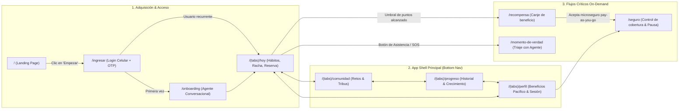

# Feature 04: Arquitectura de Rutas, Páginas Navegables y Flujo del Producto

> **Estado:** Especificación de arquitectura y navegación  
> **Objetivo:** Definir el ecosistema navegable completo de FIBO para garantizar una experiencia de usuario consistente, fluida y sin callejones sin salida.

---

## 1. Mapa Global de Rutas y Páginas Navegables

---

## 2. Matriz de Páginas y Contenido Detallado

| Ruta | Nombre de Pantalla | Propósito Principal | Elementos Clave de UI |
|---|---|---|---|
| `/` | **Landing Page** | Presentación de valor, storytelling de marca, waitlist y referidos. | Hero interactivo, calculadora de Reserva, comparativa vs seguros tradicionales, testimonios Gen Z, FAQ. |
| `/ingresar` | **Acceso & Autenticación** | Login sin contraseña mediante número celular de Perú. | Input celular con formato `XXX XXX XXX`, botón con spinner de carga, `InputOTP` de 4 celdas, opción "Cambiar número". |
| `/onboarding` | **Diagnóstico Conversacional** | Personalización inicial guiada por el agente FIBO (LLM). | Chat empático, selección de situación (independiente / estudiante), elección de prioridades (ahorro / salud / mente). |
| `/(tabs)/hoy` | **Dashboard Diario** | El centro de operaciones de la rutina del usuario. | Selector de días (`L M M J V S D`), badge de racha activa 🔥, indicador visual de la Reserva, lista de 3+ hábitos, botón `+ Nuevo Hábito` con Drawer. |
| `/(tabs)/comunidad` | **Comunidad & Retos** | Rendición de cuentas social, motivación de pares y retos grupales. | Tarjetas de retos del mes, selector de tribus (UCSUR, Freelancers), microseguro contextual de pichanga/viaje con Yape. |
| `/(tabs)/progreso` | **Evolución de la Reserva** | Demostración visual del crecimiento compuesto de la cobertura. | Gráfica de puntos acumulados (`Recharts`), barra de hitos hacia el siguiente nivel de seguro, histórico de hábitos completados. |
| `/(tabs)/perfil` | **Mi Perfil & Alianzas** | Identidad del usuario y servicios de valor agregado. | Teléfono del usuario, accesos directos a **Dr. Online** y **Quererte Sano** de Pacífico, estado de la cuenta, botón de cerrar sesión. |
| `/recompensa` | **Desbloqueo de Recompensa** | El puente entre hábitos y seguro formal (derecho moral ganado). | Felicitación personalizada, canje de beneficio inmediato (suscripción mindfulness), oferta transparente del microseguro pausable. |
| `/seguro` | **Control de Microseguro** | Gestión total de la cobertura pay-as-you-go sin penalidades. | Toggle interactivo Activo / Pausado (color terracota), monto de prima mensual simbólica (S/ 9.90), historial de pagos vía Yape. |
| `/momento-de-verdad` | **Asistencia & Reclamos** | Apoyo empático e inmediato ante una emergencia médica o accidente. | Triaje asistido por IA, verificación de póliza express, botón de llamada directa o derivación a central médica de Pacífico. |

---

## 3. Principios de Interacción en el Prototipo

1. **Persistencia y Reactividad Global:** Todo cambio (marcar hábito, agregar nuevo hábito, pausar seguro) actualiza el estado global (`useReserva`) y se refleja en todas las pestañas sin recargar.
2. **Cero Estados Vacíos Tristes:** Si no hay actividades en un día, se muestra una ilustración motivadora y sugerencias de activación.
3. **Flujo Cíclico sin Salidas Falsas:** Cada acción conduce a un paso siguiente claro con botones visibles de regreso (`Atrás` o breadcrumbs).
