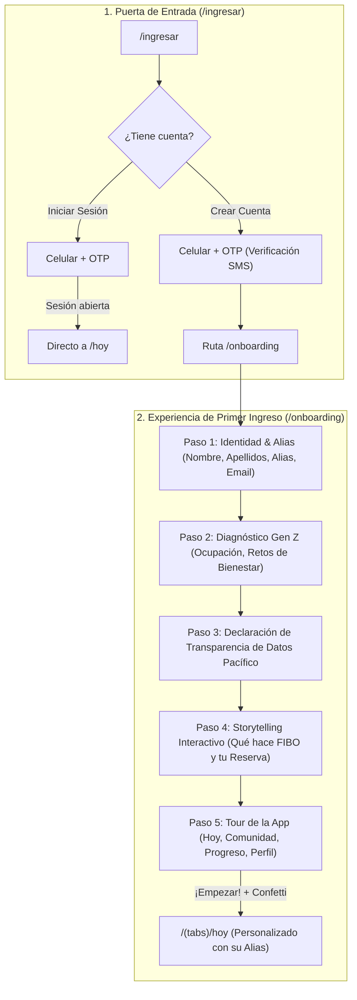

# Feature 07: Flujo de Registro, Declaración de Datos y Onboarding de Primer Ingreso

> **Estado:** Especificación aprobada para implementación  
> **Rutas involucradas:**  
> - `app/app/(app)/ingresar/page.tsx` (Bifurcación: Iniciar Sesión vs. Crear Cuenta)  
> - `app/app/(app)/onboarding/page.tsx` y `onboarding-view.tsx` (Experiencia integral de Primer Ingreso)  
> **Público objetivo:** Usuarios por primera vez (Gen Z: Universitarios, Primer Empleo, Freelancers).  
> **Fundamento en Research & Mentoría:**  
> - *Decisión 04 Set. (Luiggi & Cami, Pacífico):* "Transparencia de datos: El onboarding anuncia desde el inicio que se ofrecerán microseguros según la constancia del usuario — sin sorpresas, con consentimiento" (`hallazgos-mentoria-04-set.md` §3.6).  
> - *Insight Gen Z:* 84% de los jóvenes abandona apps financieras si el onboarding pide demasiada información sin explicar el beneficio directo (Sapien Labs 2026 / La Chakra 2026).

---

## 1. Arquitectura del Flujo: De Invitado a Usuario Activo



---

## 2. Detalle de los 5 Pasos del Onboarding de Primer Ingreso

### Paso 1: Datos de Identidad & Alias ("¿Cómo te llamamos?")
- **Objetivo:** Capturar los datos indispensables para personalizar la experiencia y formalizar el perfil sin fricción burocrática.
- **Campos:**
  1. `Nombres` y `Apellidos` (validación de texto).
  2. `Alias / Cómo te gusta que te llamen` (ej. "Cami", "Nico", "Dani") -> Este nombre alimentará el saludo en `/hoy` y el perfil social.
  3. `Correo Electrónico` (para envío de pólizas de Pacífico y notificaciones).
- **Micro-copy:** *"Tu nombre nos ayuda a saludarte como un amigo, no como un banco."*

### Paso 2: Mini-encuesta de Diagnóstico & Arquetipo
- **Objetivo:** Conocer el contexto laboral y emocional del usuario para calibrar sus hábitos iniciales.
- **Pregunta 1: ¿Cuál es tu ocupación principal?**
  - [ ] 🎓 Estudiante universitario o de instituto (UCSUR, etc.)
  - [ ] 💼 Primer empleo formal (en planilla)
  - [ ] 💻 Freelancer, creador digital o independiente
- **Pregunta 2: ¿Cuál es tu mayor desafío de bienestar hoy?**
  - [ ] 🪙 Desorganización financiera (Control de gastos y ahorro)
  - [ ] 🏃 Sedentarismo y falta de energía
  - [ ] 🧠 Estrés académico/laboral y sobrecarga mental
- **Pregunta 3: ¿Qué pilar quieres priorizar primero?**
  - [ ] 💰 Salud Financiera (Hábito de ahorro diario)
  - [ ] 🏃 Cuerpo (Moverme 15-20 min al día)
  - [ ] 🧠 Mente (Pausas conscientes y Dr. Online)

### Paso 3: Declaración de Transparencia y Protección de Datos
- **Objetivo:** Garantizar consentimiento informado con un tono formal, profesional e institucional, transmitiendo confianza sin recurrir a frases informales ni términos confusos (como "subsidio").
- **Copy formal aprobado:**
  > *"En FIBO, tus datos de bienestar se gestionan con estricta confidencialidad para calcular tu Reserva de Protección y activar tus beneficios de salud preventiva.*  
  > *1. Usamos el cumplimiento de tus hábitos para otorgarte puntos de Reserva y activar beneficios de salud preventiva (telemedicina con Dr. Online).*  
  > *2. Nunca venderemos tu información personal ni médica a terceros, marcas, agencias o empleadores.*  
  > *3. Si tienes una semana difícil o te enfermas, tu Escudo de Racha protege tus logros acumulados, garantizando un acompañamiento libre de penalizaciones."*
- **Checkbox de confirmación:** *"Acepto el tratamiento transparente de mis datos de bienestar para activar mi Reserva y beneficios con FIBO."*

### Paso 4: Storytelling Interactivo ("El Poder de tu Reserva")
Se desvincula la experiencia de un "seguro tradicional" y se mapea con claridad qué es gratuito por constancia vs. qué requiere un micropago opcional:

1. 🌀 **1. Hábitos Diarios Conscientes (100% Ganado por Constancia):**  
   Pequeñas acciones diarias de un minuto (apartar un ahorro, caminar 15 min, una pausa mental) suman puntos a tu Reserva de Bienestar. No cuesta dinero, cuesta constancia.
2. 🛡️ **2. Respaldo y Telemedicina Preventiva (Beneficio Desbloqueado):**  
   Al acumular puntos en tu Reserva, desbloqueas consultas médicas ilimitadas 24/7 (Dr. Online) sin copago y un fondo de cobertura proyectada de hasta S/ 15,000 para emergencias.
3. 👥 **3. Coberturas On-Demand Opcionales (Micropago Pay-as-you-go):**  
   Cuando lo necesites (deporte con amigos, salidas de fin de semana o viajes), puedes activar micro-coberturas por día desde S/ 3.50 directo con Yape. Tú decides cuándo activar y cuándo pausar, sin contratos forzosos ni penalidades.

### Mecanismo de Persistencia y Detección de Estado
- **¿Dónde se guarda?**  
  En el cliente, dentro del `localStorage` del navegador bajo la clave `fibo_reserva_v1`, sincronizado con `ReservaContext`.
- **¿Cómo sabe la app si el usuario ya hizo el onboarding?**  
  El estado contiene la propiedad booleana `onboardingDone: boolean` y el objeto `sesion.perfil`:
  1. Si `onboardingDone === false` o `perfil === undefined`: cualquier intento de entrar al app redirige a `/onboarding`.
  2. Al finalizar el Paso 5, se despacha `{ type: "guardar-perfil", perfil }` y `{ type: "completar-onboarding" }`, marcando `onboardingDone: true` y guardando el `perfil` con su `alias`.
  3. En futuros ingresos desde `/ingresar` con modo "Iniciar sesión", la app detecta `state.onboardingDone === true` y envía al usuario directamente a `/hoy` sin repetir el onboarding.

### Paso 5: Mini-Tour del App Shell
Un visor rápido de las 4 secciones que el usuario tendrá a su disposición:
- 🏠 **Hoy:** Tu rutina diaria, selector semanal y racha activa 🔥.
- 👥 **Comunidad:** Retos del mes, tribus y seguros on-demand de pichangas.
- 📈 **Progreso:** Gráfica de crecimiento compuesto y coberturas acumuladas.
- 👤 **Perfil:** Tus insignias, nivel de protección y amigos conectados.

---

## 3. Wireframes del Flujo

### 3.1. Selector en `/ingresar`
```
+-------------------------------------------------------------+
|                        [ Logo FIBO ]                        |
|                                                             |
|           [ Iniciar sesión ]       [ Crear cuenta ]         |
|                                                             |
|  Crea tu cuenta con tu celular                              |
|  Te enviaremos un código de verificación SMS.               |
|                                                             |
|  Celular: [ 999 999 999                                   ] |
|                                                             |
|  [                     Continuar                          ] |
|                                                             |
|  ¿Ya tienes cuenta? [ Iniciar sesión aquí ]                 |
+-------------------------------------------------------------+
```

### 3.2. Pantalla de Onboarding Modular (`/onboarding`)
```
+-------------------------------------------------------------+
|  [Logo FIBO]                     Paso 1 de 5  [========   ] |
+-------------------------------------------------------------+
|                                                             |
|  Queremos conocerte ✨                                      |
|  Solo te tomará un minuto configurar tu experiencia.        |
|                                                             |
|  Nombres:       [ Camila                                  ] |
|  Apellidos:     [ Rodríguez                               ] |
|  ¿Cómo te llamamos?: [ Cami                               ] |
|  Correo:        [ camila.r@ucsur.edu.pe                   ] |
|                                                             |
|  [                      Siguiente                         ] |
+-------------------------------------------------------------+
```

---

## 4. Cambios en Modelo de Datos (`useReserva`)

Se enriquece `SesionEstado` y `UsuarioPerfil` en `app/lib/reserva/types.ts`:
```typescript
export type UsuarioPerfil = {
  nombres: string
  apellidos: string
  alias: string
  email: string
  ocupacion: "estudiante" | "empleo" | "independiente"
  desafioPrincipal: "dinero" | "cuerpo" | "mente"
  pilarPrioritario: "bolsillo" | "cuerpo" | "mente"
  consentimientoDatos: boolean
}

export type SesionEstado = {
  telefono: string
  perfil?: UsuarioPerfil
}
```

---

## 5. Criterios de Aceptación
1. En `/ingresar`, el usuario puede conmutar claramente entre "Iniciar sesión" y "Crear cuenta".
2. Si elige "Crear cuenta", tras validar el OTP de 4 celdas, es redirigido a `/onboarding`.
3. El onboarding guía al usuario a través de los 5 pasos con barra de progreso superior.
4. Al finalizar el paso 5, el nombre/alias del usuario se guarda en el estado global y `/hoy` lo saluda: *"¡Hola, [Alias]! ✨"*.
5. El perfil `/perfil` refleja el nombre, alias y correo ingresados.
